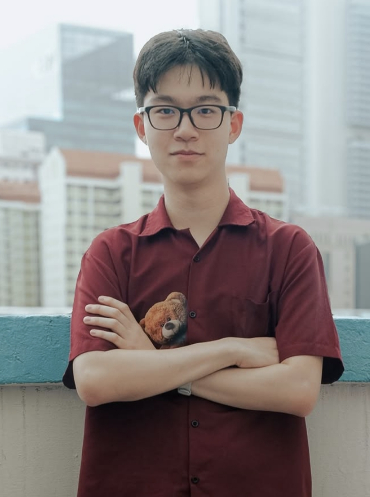
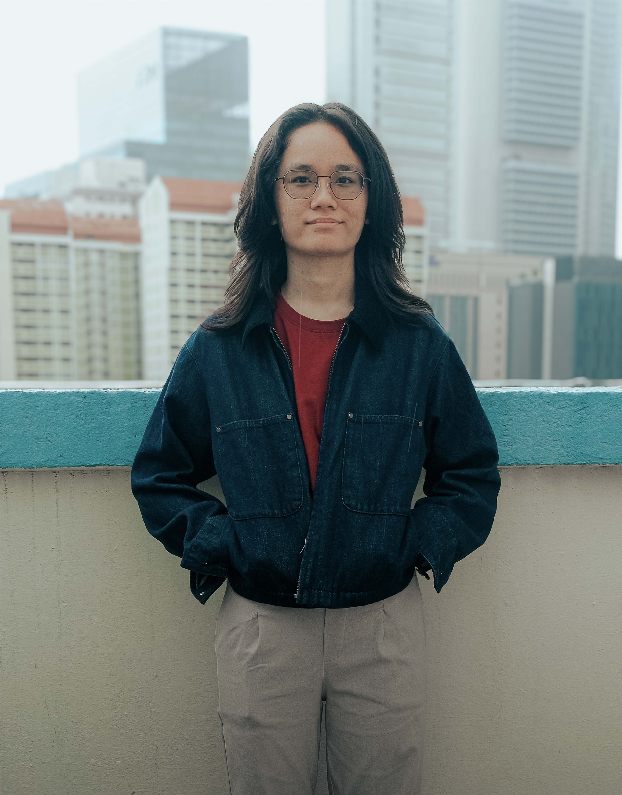
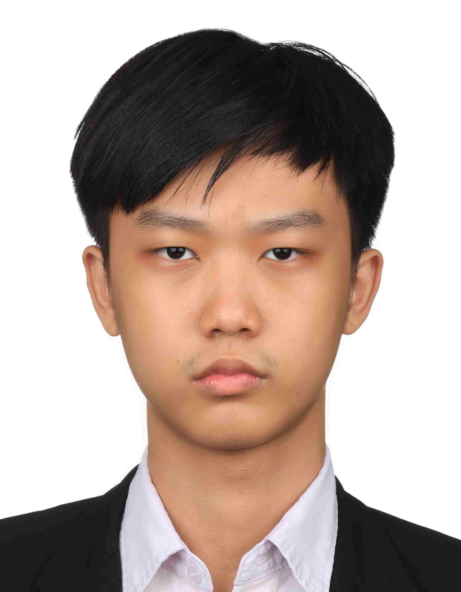
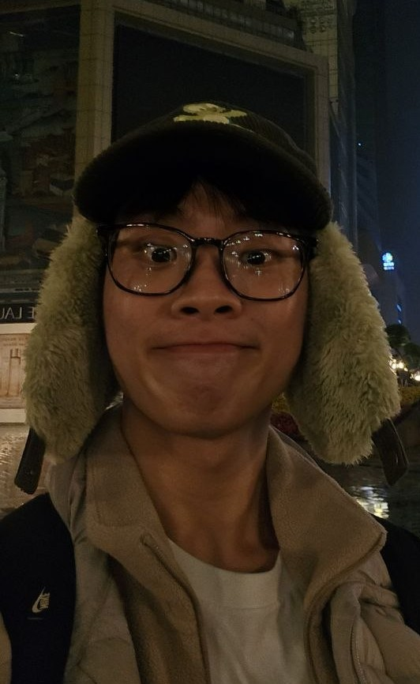
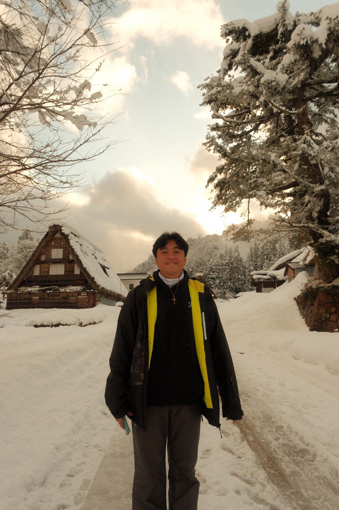

# About Us

We are a team based in the [School of Computing, National University of Singapore](http://www.comp.nus.edu.sg).

You can reach us at the email `seer[at]comp.nus.edu.sg`

## Project team

### Evan Nathanael

[[github](https://github.com/evannathanael)]

* Role: Team Lead
* Responsibilities: In Charge of Tags

### Vicky Lim

[[github](https://github.com/vickylim08)]

* Role: Developer
* Responsibilities: Testing, Scheduling and Tracking

### Elbert Tristan Lie

[[github](https://github.com/yuanshengbronze)]

* Role: Developer
* Responsibilites: Code Quality, In Charge of Events

### Koh Yu Jian

[[github](http://github.com/yujiankoh)]

* Role: Developer
* Responsibilities: Documentation, In charge of Contact

### Winston Mulyadi

[[github](https://github.com/winstonmulyadinus)]

* Role: Developer
* Responsibilities: Integration
