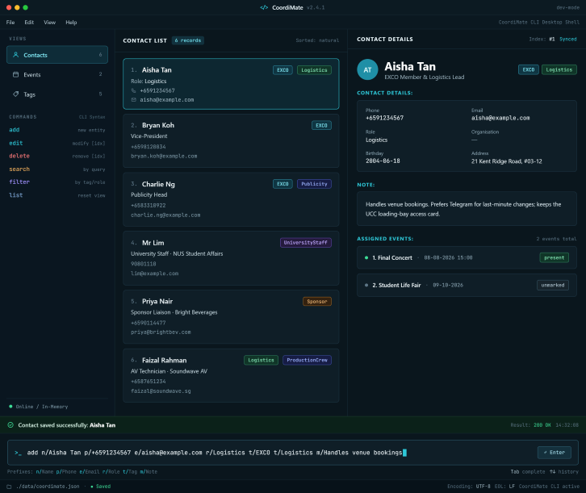

# CoordiMate User Guide

**CoordiMate** is a desktop application that helps university CCA EXCO members organise committee information and coordinate their work. It lets users manage contacts and tags, plan events, assign members, and track attendance through a Command Line Interface (CLI) while retaining the benefits of a Graphical User Interface (GUI).

<!-- * Table of Contents -->
<page-nav-print />

--------------------------------------------------------------------------------------------------------------------

## Quick start

1. Ensure that Java `25` or later is installed on your computer.<br>
   **Mac users:** Ensure you have the precise JDK version prescribed [here](https://se-education.org/guides/tutorials/javaInstallationMac.html).

1. Download the latest `.jar` file from [here](https://github.com/AY2627S1-CS2103T-W12-3/tp/releases).

1. Copy the file to the folder you want to use as the _home folder_ for CoordiMate.

1. Open a terminal, `cd` to the folder containing the JAR file, and run `java -jar coordimate.jar`.<br>
   A GUI similar to the one below should appear in a few seconds. Note how the app contains some sample data.<br>
   

1. Type a command in the command box and press Enter to execute it. For example, type **`help`** and press Enter to open the help window.<br>
   Some example commands you can try:

   * `list` : Lists all contacts.

   * `add n/John Doe p/98765432 e/johnd@example.com r/Member` : Adds a contact named `John Doe` to CoordiMate.

   * `delete 3` : Deletes the 3rd contact shown in the current list.

   * `clear` : Deletes all contacts.

   * `exit` : Exits the app.

   In the Contacts view, select a contact from the displayed list to see their phone number, email address,
   role, birthday, address, organisation, tags, and note in the details pane. The number beside a contact is
   its index in the currently displayed list. If a list change hides the selected contact, the details pane clears.
   Unset optional fields show `— (not specified)`; a contact with no tags shows no tag chips.

1. Refer to the [Features](#features) section below for details of each command.

--------------------------------------------------------------------------------------------------------------------

## Features

<box type="info" seamless>

**Notes about the command format:**<br>

* Words in `UPPER_CASE` are the parameters to be supplied by the user.<br>
  For example, in `add n/NAME`, replace `NAME` with a value such as `John Doe`.

* Items in square brackets are optional.<br>
  For example, `n/NAME [t/TAG]` can be used as `n/John Doe t/friend` or as `n/John Doe`.

* Items followed by `...` can appear zero or more times.<br>
  For example, `[t/TAG]... ` may be omitted, or written as `t/friend` or `t/friend t/family`.

* Parameters can be in any order.<br>
  For example, if the command specifies `n/NAME p/PHONE_NUMBER`, `p/PHONE_NUMBER n/NAME` is also acceptable.

* Extraneous parameters for commands that take no parameters, such as `help`, `list`, `exit`, and `clear`, are ignored.<br>
  For example, `help 123` is interpreted as `help`.

* If you are using a PDF version of this document, be careful when copying and pasting commands that span multiple lines as space characters surrounding line-breaks may be omitted when copied over to the application.
</box>

### Viewing help: `help`

Shows a message explaining how to access the help page.


Format: `help`


### Adding a person: `add`

Adds a person to CoordiMate.

Contact names must be unique after trimming surrounding spaces and ignoring case.
An add is also rejected if its phone number or email address is already used by another contact.
Phone numbers are compared without spaces, hyphens, or brackets; email addresses are compared without regard to case.
For any duplicate, CoordiMate reports `A contact with this name, phone number, or email already exists.`
and makes no changes.
If the local contact data cannot be loaded or saved, CoordiMate reports an error and leaves the contact list unchanged.

Format: `add n/NAME p/PHONE e/EMAIL r/ROLE [b/BIRTHDAY] [a/ADDRESS] [o/ORGANISATION] [t/TAG]... [m/NOTE]`

Name, phone, email, and role are required. Birthday uses `dd-MM-yyyy` and cannot be in the future.
Address, organisation, and note are optional. An empty `b/`, `a/`, `o/`, or `m/` leaves that field unset,
as does omitting it. Non-tag fields may appear only once; `t/TAG` may repeat. An empty `t/` clears the
tags collected so far. A valid new tag is saved as a custom tag. Successful feedback is
`Contact saved successfully: NAME`.
Select the saved contact in the list to view all its details. Unset optional values are shown as
`— (not specified)` in the details pane, but remain unset in storage.

<box type="tip" seamless>

**Tip:** A contact can have any number of tags, including zero. Parameters can be supplied in any order.
</box>

Examples:
* `add n/Aisha Tan p/+6591234567 e/aisha@example.com r/Logistics t/EXCO m/Handles venue bookings`
* `add n/Mr Lim p/90801110 e/lim@example.com o/NUS Student Affairs r/University Staff t/UniversityStaff`

### Adding an event: `addevent`

Creates an event and saves it to the local data file.

Format: `addevent evn/EVENT_NAME st/START_TIME et/END_TIME`

Each parameter must appear once. Event names must contain a non-whitespace character;
leading and trailing whitespace is removed. Names must be unique, ignoring case.
Different events may share the same start and end times.

Start and end times use `dd-MM-yyyy`, optionally followed by `HH:mm` in 24-hour format.
Date-only values are saved without a time of day. The `/et` spelling from the examples
is also accepted as an alternative to `et/`.

The start must not be after the end. Equal start and end values are allowed.
Dates are compared first. On the same date, times are compared only when both are
specified. Invalid ordering reports: `Start time must not be after end time.`

Examples:

* `addevent evn/Final Concert st/08-08-2026 15:00 et/08-08-2026 18:00`
* `addevent evn/Student Life Fair st/09-10-2026 /et 10-10-2026`

Success: `Created Event Student Life Fair. Start Time: 09-10-2026. End Time: 10-10-2026.`

Use the **Events** tab on the left to browse saved events. Selecting an event shows its
start time, end time, duration, and members. A successful `addevent` opens this tab and selects
the new event. At narrower window sizes, the list appears above the details.

Command feedback appears above the input at the bottom of the window. Rejected commands
show a red feedback band and input border. The command stays in the input so you can
correct it, then press Enter or click **Retry**.

If saving fails, no event is added. If the existing data file is invalid, the command
reports a load error and leaves the file untouched.

### Editing an event: `editevent`

Edits the name, start time, and/or end time of an existing event and saves the changes.

Format: `editevent evn/EVENT_NAME [nevn/NEW_EVENT_NAME] [st/NEW_START_TIME] [et/NEW_END_TIME]`

`EVENT_NAME` must match the saved name, ignoring case. Leading and trailing whitespace
is removed. Lookup capitalization does not change the saved display name; `nevn/`
sets the new display name using the supplied capitalization.
Provide at least one field to edit; omitted fields
keep their existing values. Each parameter may appear only once.

The new name must contain a non-whitespace character and must not duplicate another
event's name, ignoring case. Start and end times use `dd-MM-yyyy [HH:mm]`; a date is
required and a 24-hour time is optional. The updated start must not be after the
updated end, using the same ordering rules as `addevent`.

Examples:

* `editevent evn/Final Concert st/08-08-2026 16:00 et/08-08-2026 19:00`
* `editevent evn/Student Life Fair nevn/NUS Student Life Fair et/10-10-2026`
* `editevent evn/CCA MEETING nevn/CCA MEETING` changes the display name of `CCA Meeting` to `CCA MEETING`.

Success: `Edited Event NUS Student Life Fair. Start Time: 09-10-2026. End Time: 10-10-2026.`

| Condition | Error message |
|---|---|
| No saved event has the supplied name, ignoring case. | `Event {EVENT_NAME} does not exist.` |
| The new event name is empty. | `New event name must not be empty.` |
| A new time is empty, invalid, or incorrectly formatted. | `New start time and/or new end time are formatted as dd-MM-yyyy [HH:mm]. Time of day is optional. Example: 17-09-2026 16:30` |
| The new name duplicates another event. | `This update conflicts with another saved event. No changes were made.` |
| No field is provided to edit. | `Please provide at least one field to edit.` |
| A parameter is repeated. | `Each parameter may only be specified once.` |
| An unknown parameter is used. | `Unknown parameter. Example: edit 2 r/Logistics` |
| The updated start is after the updated end. | `Start time must not be after end time.` |

If saving fails, the event and existing data file remain unchanged.

### Deleting an event: `deleteevent`

Deletes the event with the supplied name, ignoring capitalization. Internal spacing
must match the existing event name.

Format: `deleteevent evn/EVENT_NAME`

Examples:

* `deleteevent evn/Final Concert`
* `deleteevent evn/Student Life Fair`

Success: `Deleted Event Final Concert.`

If the event does not exist, the command reports `Event {EVENT_NAME} does not exist.`
An unknown parameter reports `Unknown parameter. Example: deleteevent evn/Logistics Meeting`.
If saving fails, the event and existing data file remain unchanged.

### Assigning members to an event: `assign`

Assigns one or more contacts to an existing event as members and saves the change.

Format: `assign evn/EVENT_NAME c/CONTACT_INDEX [MORE_CONTACT_INDEXES]...`

* `EVENT_NAME` must match a saved event name, ignoring case. Leading and trailing whitespace is removed.
* `CONTACT_INDEX` refers to the index number shown in the displayed person list. If the list is filtered (e.g. after `find`), the index refers to the filtered list. Use `list` to show everyone again. Separate several indexes with spaces. Each index **must be a positive integer** 1, 2, 3, ...
* Each parameter may appear only once.
* All indexes are checked before any change is made. If any index is invalid, no contacts are assigned.
* Contacts who are already assigned to the event are skipped, and an index repeated in the same command is counted once.
* New members are added after the existing members, in the order given.

Selecting the event in the **Events** tab shows its members under **Members**.

Examples:

* `assign evn/Final Concert c/2` assigns the 2nd person in the displayed list to `Final Concert`.
* `assign evn/student life fair c/1 4 5` assigns the 1st, 4th and 5th persons to `Student Life Fair`.
* `find Bernice` followed by `assign evn/Final Concert c/1` assigns the 1st person in the results of the `find` command.

Success: `Assigned 2 member(s) to Final Concert.`

If some contacts were already assigned: `Assigned 1 member(s) to Final Concert. 1 contact(s) were already assigned.`

| Condition | Error message |
|---|---|
| No saved event has the supplied name, ignoring case. | `Event {EVENT_NAME} does not exist.` |
| An index is larger than the displayed person list. | `Contact {CONTACT_INDEX} does not exist in the displayed list.` |
| An index is not a positive integer. | `Contact indexes must be positive integers separated by spaces. Example: c/1 3 5` |
| Every specified contact is already assigned. | `All specified contacts are already assigned to {EVENT_NAME}. No changes were made.` |
| The event name is empty. | `Event name must not be empty.` |
| `c/` has no indexes. | `Please specify at least one contact to assign.` |
| `evn/` or `c/` is missing. | `Invalid command format!` followed by the command format |
| A parameter is repeated. | `Each parameter may only be specified once.` |
| An unknown parameter is used. | `Unknown parameter. Example: assign evn/Final Concert c/2 3` |

If saving fails, no contacts are assigned and the existing data file remains unchanged.

### Removing members from an event: `unassign`

Removes one or more members from an existing event and saves the change. The contacts themselves are not deleted.

Format: `unassign evn/EVENT_NAME c/CONTACT_INDEX [MORE_CONTACT_INDEXES]...`

* `EVENT_NAME` must match a saved event name, ignoring case. Leading and trailing whitespace is removed.
* `CONTACT_INDEX` refers to the index number shown in the displayed person list, as in `assign`. If the list is filtered (e.g. after `find`), the index refers to the filtered list. Use `list` to show everyone again. Separate several indexes with spaces. Each index **must be a positive integer** 1, 2, 3, ...
* Each parameter may appear only once.
* All indexes are checked before any change is made. If any index is invalid, no members are removed.
* Contacts who are not assigned to the event are skipped, and an index repeated in the same command is counted once.
* The remaining members keep their order.
* A removed member's attendance record for the event, if any, is also removed. Other members' attendance is kept.

Examples:

* `unassign evn/Final Concert c/2` removes the 2nd person in the displayed list from `Final Concert`.
* `unassign evn/student life fair c/1 3` removes the 1st and 3rd persons from `Student Life Fair`.
* `find Bernice` followed by `unassign evn/Final Concert c/1` removes the 1st person in the results of the `find` command.

Success: `Removed 2 member(s) from Final Concert.`

If some contacts were not assigned: `Removed 1 member(s) from Final Concert. 1 contact(s) were not assigned.`

| Condition | Error message |
|---|---|
| No saved event has the supplied name, ignoring case. | `Event {EVENT_NAME} does not exist.` |
| An index is larger than the displayed person list. | `Contact {CONTACT_INDEX} does not exist in the displayed list.` |
| An index is not a positive integer. | `Contact indexes must be positive integers separated by spaces. Example: c/1 3 5` |
| None of the specified contacts are assigned. | `None of the specified contacts are assigned to {EVENT_NAME}. No changes were made.` |
| The event name is empty. | `Event name must not be empty.` |
| `c/` has no indexes. | `Please specify at least one contact to remove.` |
| `evn/` or `c/` is missing. | `Invalid command format!` followed by the command format |
| A parameter is repeated. | `Each parameter may only be specified once.` |
| An unknown parameter is used. | `Unknown parameter. Example: unassign evn/Final Concert c/2 3` |

If saving fails, no members are removed and the existing data file remains unchanged.

### Viewing members of an event: `members`

Shows only the members of an event in the contact list, with their full contact details.

Format: `members evn/EVENT_NAME`

* `EVENT_NAME` must match a saved event name, ignoring case. Leading and trailing whitespace is removed.
* CoordiMate switches to the **Contacts** view and lists the event's members in contact list order.
* The members' index numbers can be used directly in other commands, such as `unassign`, `edit` and `delete`.
* The list stays up to date while it is shown: members removed with `unassign` disappear from it, and renaming the event with `editevent` keeps showing its members. If the event is deleted, the list becomes empty.
* `add` and `edit` show all contacts again afterwards, so that you can see the contact you changed.
* Use `list` to show all contacts again.

Selecting an event in the **Events** tab also shows its member names under **Members**, in the order they were assigned.

Examples:

* `members evn/Final Concert` shows the members of `Final Concert`.
* `members evn/student life fair` shows the members of `Student Life Fair`.
* `members evn/Final Concert` followed by `unassign evn/Final Concert c/2` removes the 2nd member shown.

Success: `Listed 2 member(s) of Final Concert. Use list to show all contacts.`

If the event has no members, the contact list is empty: `Final Concert has no members assigned. Use list to show all contacts.`

| Condition | Error message |
|---|---|
| No saved event has the supplied name, ignoring case. | `Event {EVENT_NAME} does not exist.` |
| The event name is empty. | `Event name must not be empty.` |
| `evn/` is missing, or there is text before it. | `Invalid command format!` followed by the command format |
| `evn/` is repeated. | `Each parameter may only be specified once.` |
| An unknown parameter is used. | `Unknown parameter. Example: members evn/Final Concert` |

If an error occurs, the contact list stays as it was.

### Listing all persons: `list`

Shows a list of all persons in CoordiMate.

Format: `list`

### Deleting a tag: `deletetag`

Deletes an existing tag and removes it from every contact to which it is assigned.

Format: `deletetag t/TAG`

Examples:

* `deletetag t/ProductionCrew`
* `deletetag t/Publicity`

The tag name is matched case-insensitively.

Success: `{TAG_NAME} successfully deleted.`

| Condition | Error message |
|---|---|
| The `t/` prefix is missing. | `No prefix given.` |
| No tag name is provided. | `No tag name given.` |
| The specified tag does not exist. | `No such tag exists: {TAG_NAME}.` |
### Editing a tag: `edittag`

Renames an existing tag, including a default tag, and updates it wherever it is applied across contacts.

Format: `edittag OLD_TAG t/NEW_TAG`

Examples:

* `edittag Production t/ProductionCrew`
* `edittag Media t/Publicity`

`OLD_TAG` must match an existing tag, ignoring capitalization. `NEW_TAG` must contain 1 to 30
alphanumeric characters without spaces. Leading and trailing whitespace is trimmed before validation.

Success for `edittag Media t/Publicity`: `Media successfully renamed to Publicity.`

| Condition | Error message |
|---|---|
| The current tag does not exist. | `No such tag exists: {OLD_TAG}.` |
| The `t/` prefix is missing. | `No prefix given.` |
| The current tag name is missing. | `Current tag name is not defined.` |
| The new tag name is missing. | `New tag name is not defined.` |
| The new tag name is blank. | `Tag name cannot be empty.` |
| More than one `t/` prefix is supplied. | `Multiple tag names given.` |
| The new tag contains spaces, symbols, or punctuation. | `Tag names should be alphanumeric with no spaces.` |
| The new tag exceeds 30 characters. | `Tag names should not exceed 30 characters.` |
| The new tag matches the current tag, ignoring capitalization. | `{NEW_TAG} is the same as {OLD_TAG}.` |
| The new tag already exists. | `This tag already exists.` |

### Creating a tag: `newtag`

Creates a custom tag and opens the Tags view. Tag names must contain 1 to 30 alphanumeric characters without spaces.
Leading and trailing whitespace is trimmed. Tag names preserve their capitalization, but are unique regardless of
capitalization.

Format: `newtag t/TAG`

Examples:

* `newtag t/ProductionCrew`
* `newtag t/Publicity`

If a tag named `Publicity` already exists, commands such as `newtag t/publicity` are rejected as duplicates.

Success: `Created tag: Publicity.`

| Condition | Error message |
|---|---|
| No parameters are supplied. | `No parameters given.` |
| The `t/` prefix is missing. | `No prefix given.` |
| More than one `t/` prefix is supplied. | `Multiple tag names given.` |
| Text appears before `t/`. | `Unknown parameters given.` |
| The tag name is empty. | `Tag name cannot be empty.` |
| The tag name contains spaces, symbols, or punctuation. | `Tag names should be alphanumeric with no spaces.` |
| The tag name exceeds 30 characters. | `Tag names should not exceed 30 characters.` |
| The tag name already exists, ignoring capitalization. | `This tag already exists.` |

### Listing all tags: `listtags`

Shows every default and custom tag in the Tags view.

Format: `listtags`

### Editing a person: `edit`

Edits an existing person in CoordiMate.

Format: `edit INDEX [n/NAME] [p/PHONE] [e/EMAIL] [r/ROLE] [b/BIRTHDAY] [a/ADDRESS] [o/ORGANISATION] [m/NOTE] [t/TAG]... [at/TAG]... [rt/TAG]...`

Or: `edit target/IDENTIFIER [n/NAME] [p/PHONE] [e/EMAIL] [r/ROLE] [b/BIRTHDAY] [a/ADDRESS] [o/ORGANISATION] [m/NOTE] [t/TAG]... [at/TAG]... [rt/TAG]...`

* Edits the person at the specified `INDEX`. The index refers to the index number shown in the displayed person list. The index **must be a positive integer** 1, 2, 3, ...
* Alternatively, `target/IDENTIFIER` finds an exact saved name, phone number, or email address across all contacts, including those hidden by the current search or filter. Names and emails ignore letter case; phone numbers ignore spaces, hyphens, and brackets. Supply either an index or `target/`, not both.
* If several contacts match an identifier, the command lists each match's name, phone, and email. An index appears only for a match in the current displayed list. Retry with a unique phone or email, or a displayed index.
* If no contact matches `target/`, the command reports an error. An index outside the displayed list reports `No contact exists at index INDEX. Please use an index from the current list.`
* Provide at least one field or tag operation. Omitted fields retain their existing values.
* Name, phone, email, and role cannot be cleared. Use `b/`, `a/`, `o/`, or `m/` with no value to clear that optional field.
* Birthday uses `dd-MM-yyyy` and cannot be in the future. Edited values follow the same validation rules as `add`.
* Each non-tag field may be specified only once. Unknown parameters are rejected.
* `t/TAG` replaces all existing tags; repeat it to specify several replacement tags. `t/` with no value clears the tag set.
* `at/TAG` adds a tag without removing other tags, while `rt/TAG` removes only that tag from the contact. These may be repeated or mixed and are applied in command order. Neither may be mixed with `t/`.
* Tag matching ignores case. Adding an existing tag or removing an absent tag has no effect. A valid new tag named by `t/` or `at/` is saved as a custom tag. Empty `at/` and `rt/` values are invalid.
* If the person's name changes, events they are assigned to show the new name.
* A new name already used by another contact, ignoring case and surrounding spaces, is rejected.
* An edit is saved to the local data file before it appears in the contact list. If the file cannot be read or written,
  the edit is not applied. A failed write reports `Contact could not be saved. No changes were made.`; invalid stored
  data reports `Contact data could not be loaded. Please check the local data file.`
* On success, `edit` confirms the updated name, phone, email, and role. The selected contact's details pane shows its
  current optional fields and tags.

Successful feedback example:

```text
Contact updated successfully:
Name: Aisha Tan
Phone: +6598765432
Email: aisha@example.com
Role: President
```

Examples:
*  `edit 1 p/91234567 e/johndoe@example.com` Edits the phone number and email address of the 1st person to be `91234567` and `johndoe@example.com` respectively.
*  `edit 2 n/Betsy Crower t/` Edits the name of the 2nd person to be `Betsy Crower` and clears all existing tags.
*  `edit 3 r/Logistics Lead m/Handles venue bookings` Updates a role and note.
*  `edit 3 b/ a/ o/ m/` Clears the optional birthday, address, organisation, and note.
*  `edit target/alice@example.com r/Vice-President` Updates a contact even if the current list is filtered.
*  `edit 3 at/Sponsor rt/Logistics` Adds Sponsor, then removes Logistics without changing other tags.

### Locating persons by name: `find`

Finds persons whose names contain any of the given keywords.

Format: `find KEYWORD [MORE_KEYWORDS]`

* The search is case-insensitive; for example, `hans` matches `Hans`.
* Keyword order does not matter; for example, `Hans Bo` matches `Bo Hans`.
* The search considers only names.
* Only full words match; for example, `Han` does not match `Hans`.
* Persons matching at least one keyword are returned (an `OR` search); for example, `Hans Bo` returns `Hans Gruber` and `Bo Yang`.

Examples:
* `find John` returns `john` and `John Doe`
* `find alex david` returns `Alex Yeoh`, `David Li`<br>
  

### Deleting a person: `delete`

Finds a saved contact and asks for confirmation before deleting it.

Formats: `delete INDEX` · `delete n/NAME` · `delete p/PHONE` · `delete e/EMAIL`

* Supply exactly one identifier. `INDEX` is a positive integer in the currently displayed contact list.
* Name matching is exact apart from letter case and surrounding spaces. Phone matching ignores spaces, hyphens, and
  brackets. Email matching ignores letter case and surrounding spaces. These identifiers search all saved contacts,
  including those hidden by a search or filter.
* CoordiMate shows the contact's name, phone, email, and role, followed by `Confirm deletion? [y/N]`. Type exactly `y`
  or `Y` to delete. `n`, `N`, Enter, or any other input cancels. A cancelling input is **not** run as a command; enter it
  again if that was your intention.
* A confirmed deletion removes the contact from all event member lists, including past events. The events and other
  contacts remain saved. A cancelled deletion makes no changes.
* A confirmed deletion is saved before it appears in the contact list. A corrupt data file or failed write leaves the
  contact and events unchanged and reports a contact load or save error.

Examples:
* `list` followed by `delete 2`, then `y`, deletes the 2nd displayed contact.
* `find Betsy` followed by `delete 1`, then `Y`, deletes the 1st contact in the results.
* `delete e/aisha@example.com`, then `y`, deletes that saved contact even if a filter hides it.

On confirmation, feedback is `Contact deleted successfully: NAME.` Missing, invalid, unknown, repeated, and
non-matching identifiers are rejected without opening a confirmation prompt.

### Clearing all entries: `clear`

Clears all entries from CoordiMate.

Format: `clear`

### Exiting the program: `exit`

Exits the program.

Format: `exit`

### Saving the data

CoordiMate automatically saves data after every command. You do not need to save manually.

### Editing the data file

CoordiMate data is saved automatically as a JSON file `[JAR file location]/data/coordimate.json`. Advanced users are welcome to update data directly by editing that data file.

<box type="warning" seamless>

**Caution:**
If your changes make the data file invalid, CoordiMate starts with an empty dataset at the next run. The invalid file remains on disk until you run a command (CoordiMate saves after every command). Still, we recommend backing up the file before editing it.<br>
Each name in an event's `members` list must exactly match the name of a saved person, or the data file is invalid.<br>
Furthermore, certain edits can cause CoordiMate to behave in unexpected ways (e.g., if a value entered is outside of the acceptable range). Therefore, edit the data file only if you are confident that you can update it correctly.
</box>

### Archiving data files `[coming in v2.0]`

_Details coming soon ..._

--------------------------------------------------------------------------------------------------------------------

## FAQ

**Q**: How do I transfer my data to another computer?<br>
**A**: Install the app on the other computer and overwrite the data file it creates with the data file from your previous CoordiMate home folder.

--------------------------------------------------------------------------------------------------------------------

## Known issues

1. **When using multiple screens**, if you move the application to a secondary screen, and later switch to using only the primary screen, the GUI will open off-screen. The remedy is to delete the `preferences.json` file created by the application before running the application again.
2. **If you minimize the Help Window** and then run the `help` command (or use the `Help` menu, or the keyboard shortcut `F1`) again, the original Help Window will remain minimized, and no new Help Window will appear. The remedy is to manually restore the minimized Help Window.

--------------------------------------------------------------------------------------------------------------------

## Command summary

Action     | Format, Examples
-----------|----------------------------------------------------------------------------------------------------------------------------------------------------------------------
**Add**    | `add n/NAME p/PHONE e/EMAIL r/ROLE [b/BIRTHDAY] [a/ADDRESS] [o/ORGANISATION] [t/TAG]... [m/NOTE]`<br> e.g., `add n/James Ho p/22224444 e/jamesho@example.com r/Member t/friend`
**Assign** | `assign evn/EVENT_NAME c/CONTACT_INDEX [MORE_CONTACT_INDEXES]...`<br> e.g., `assign evn/Final Concert c/1 4 5`
**Clear**  | `clear`
**Delete tag** | `deletetag t/TAG`<br> e.g., `deletetag t/Publicity`
**Delete contacts** | `delete INDEX` or `delete n/NAME`, `delete p/PHONE`, `delete e/EMAIL`; confirm with `y`<br> e.g., `delete 3`
**Edit contacts**   | `edit INDEX [n/NAME] [p/PHONE] [e/EMAIL] [r/ROLE] [b/BIRTHDAY] [a/ADDRESS] [o/ORGANISATION] [m/NOTE] [t/TAG]... [at/TAG]... [rt/TAG]...`<br> e.g., `edit 2 n/James Lee e/jameslee@example.com`
**Find**   | `find KEYWORD [MORE_KEYWORDS]`<br> e.g., `find James Jake`
**List**   | `list`
**Members** | `members evn/EVENT_NAME`<br> e.g., `members evn/Final Concert`
**Unassign** | `unassign evn/EVENT_NAME c/CONTACT_INDEX [MORE_CONTACT_INDEXES]...`<br> e.g., `unassign evn/Final Concert c/2 3`
**Help**   | `help`
